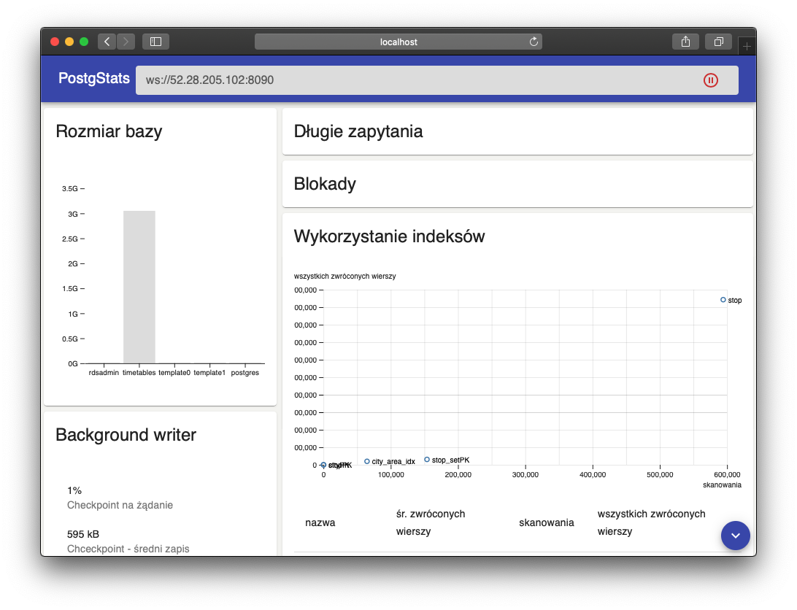

# PostgStats



Web application for monitoring Postgres database

# Team
- Konrad Mikucki
- Patryk Waluś

# Installation
## ui-web
1. download asset https://github.com/komik966/postgstats/releases/download/1.0.0/postgstats-ui-web-1.0.0.tar
2. extract files and serve them as static webpage
## api
1. download asset https://github.com/komik966/postgstats/releases/download/1.0.0/postgstats-api-1.0.0.tar
2. extract: `tar -xf postgstats-api-1.0.0.tar`
3. start server (assuming server should listen on `localhost:8090` and database is available at `localhost:5432`): `./postgstats/bin/postgstats localhost 8090 'jdbc:postgresql://localhost:5432/postgres?user=postgres&password=postgres'`

# Development setup
## ui-web
requirements:
- yarn (https://classic.yarnpkg.com/en/docs/install)
- node (https://nodejs.org/en/download/package-manager)

start server:
```
cd ./ui-web
yarn install
yarn start
```

## database
start empty postgres database:
```
docker-compose up
```
example queries available at `./database/simulation.sql`

## api
start server on `localhost:8090` which connects to local database:
```
cd ./api
./gradlew run --args="localhost 8090 'jdbc:postgresql://localhost:5432/postgres?user=postgres&password=postgres'"
```

# Building
## ui-web
```
cd ./ui-web
yarn build
```
Build result will be available at `./ui-web/build`
## api
```
cd ./api
./gradlew distTar
```
Build result will be available at `./api/build/distributions`